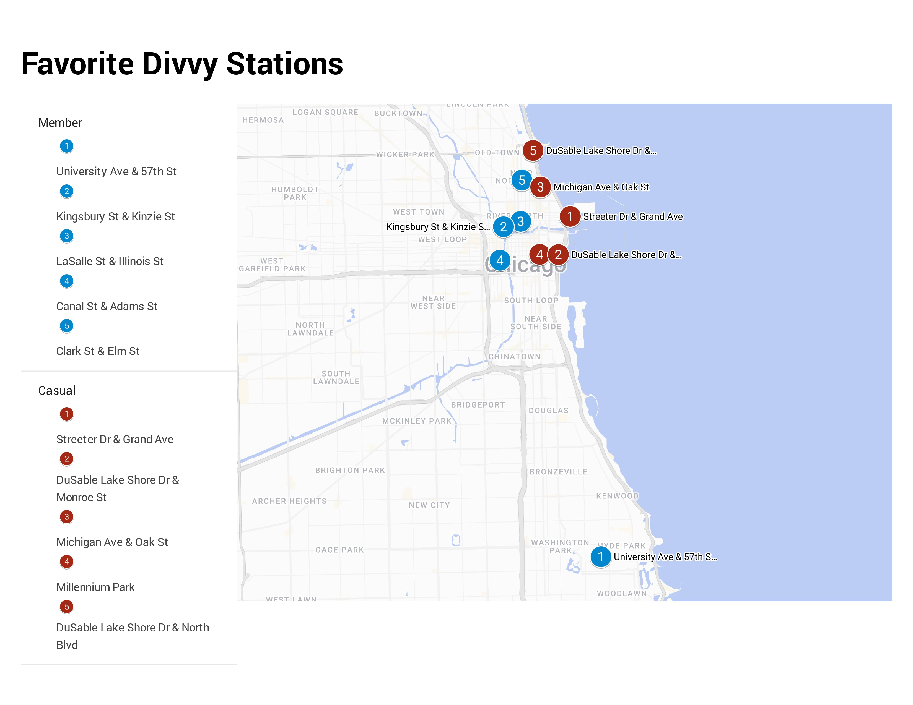
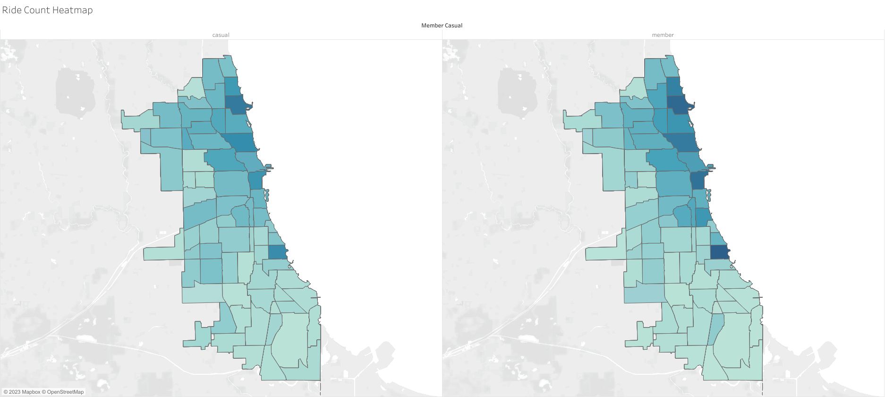
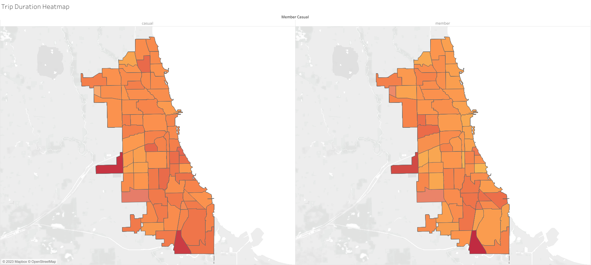
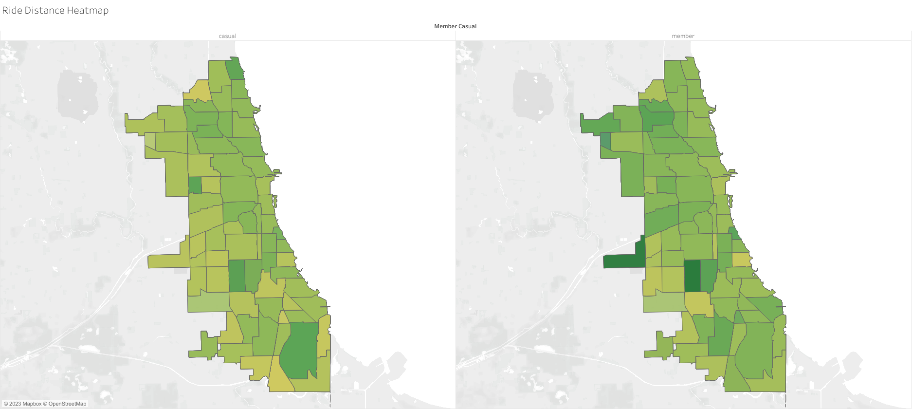

<style>
  h1 { color: #3399ff; }
  h2 { color: #99ccff; }
</style>

# Case Study Presentation

This is a case study focusing on the DivvyBikes rental service. I am conducting this analysis to apply the skills I acquired through the Google Data Analytics Certificate program hosted on [Coursera](https://www.coursera.org/professional-certificates/google-data-analytics). The main objective of this study is to identify differences between members and casual users and propose strategies to boost subscription rates for Divvy services.

---

# Analysis Summary

Based on this analysis, here are the differences between members and casual users:

  - **Members:** Likely local residents or students, prefer efficient commuting, shorter rides, and downtown/university stations.
  - **Casual Users:** Likely tourists, prefer leisurely exploration, with more spread-out station usage and longer trip durations.

To increase conversion rate, I propose these measures:

  - Introducing promotional pricing around holiday seasons, or special events.
  - Creating short-term subscription plans, such as a weekly or weekend subscription.
  - Expanding station networks in tourist-heavy areas.
  - Promoting Divvy services in these same areas.

---

# Introduction
## Company Overview

Divvy is a bicycle rental company located in Chicago, Illinois, United States.
Established in 2013, it has steadily gained popularity and currently boasts a fleet of over 6,000 bikes distributed across more than 600 stations.
The service is user-friendly: users can register through the mobile app, unlock a bike using their membership card, or pay for a single trip, and conveniently return it to a nearby station upon reaching their destination.

## Data Overview

The dataset used for this study is publicly available [here](https://divvy-tripdata.s3.amazonaws.com/index.html). It includes a separate CSV file for each month of the year, with each row representing an individual trip. The dataset contains the following columns:

  - Trip ID
  - Bike type
  - Departure station name
  - Departure station ID
  - Arrival station name
  - Arrival station ID
  - Departure date and time
  - Arrival date and time
  - Departure latitude
  - Departure longitude
  - Arrival latitude
  - Arrival longitude
  - User type (subscriber or occasional user)

---

# Set up
## Setting Up the Workspace

To kickstart the project, I created a dedicated project directory and organized various folders for this study. After establishing my work environment in RStudio, I proceeded to update and load the necessary libraries for the analysis.

```{r setup, message=FALSE, warning=FALSE}
if (!requireNamespace("tidyverse", quietly = TRUE)) install.packages("tidyverse")
if (!requireNamespace("skimr", quietly = TRUE)) install.packages("skimr")
if (!requireNamespace("RANN", quietly = TRUE)) install.packages("RANN")
if (!requireNamespace("patchwork", quietly = TRUE)) install.packages("patchwork")
if (!requireNamespace("RColorBrewer", quietly = TRUE)) install.packages("RColorBrewer")
if (!requireNamespace("tibble", quietly = TRUE)) install.packages("tibble")

library(tidyverse)
library(skimr)
library(RANN)
library(patchwork)
library(RColorBrewer)
library(tibble)
```

## Loading the CSV files

After downloading the CSV files of the past 12 months, which have been stored in the `Data/Study Data` folder, I import and consolidate them into a unified data table within my working environment.

```{r, results='hide', message=FALSE, warning=FALSE}
trip_data <- list.files("./Data/Study Data", full.names = TRUE) %>% 
  lapply(read_csv) %>% 
  bind_rows()
```

Now that I have a comprehensive data table in place, let's take a closer look at the resulting columns.

```{r}
colnames(trip_data)
```

The resulting content is what was expected. Now it's time to start with the cleaning process.

---

# Data Cleaning
## Duplicates and factors

To start off, let's take a look at a summary of the data.

```{r}
skim_without_charts(trip_data)
```

There's a lot to take in, but I will start with some preparatory steps:

  - I'll check for and remove any duplicate entries in this dataset.
  - To facilitate further analysis, I'll convert the `member_casual` and `rideable_type` columns into categorical factors, because these columns contain nominal qualitative values with a limited number of unique categories.

```{r}
clean_data <- trip_data %>% 
  distinct(ride_id, .keep_all = TRUE)

clean_data$rideable_type <- factor(clean_data$rideable_type)
clean_data$member_casual <- factor(clean_data$member_casual)
```

## NA values and zeros

After this, there are some data inconsistencies that need to be addressed:
  - I have encountered missing data for trip end coordinates. Since the number of such instances is minimal (around 0.1% of the dataset), I can safely exclude them from the study.
  - Furthermore, when examining the trip end coordinates, I've identified unusual data points. Specifically, some entries have latitudes and longitudes set to 0, which does not align with the expected Chicago coordinates. I will remove these erroneous entries from the dataset as well.

```{r}
clean_data <- clean_data %>%
  drop_na(end_lat, end_lng)

clean_data <- clean_data %>% 
  filter(end_lat != 0, end_lng != 0)
```

## Unique station names

Moving forward, I'll be tackling more substantial issues. Firstly, I've observed that there are more unique station names than there are unique station IDs, indicating potential typos or discrepancies in station names.

To address this, my initial step will involve creating a table that associates each station ID with the most frequently occurring station name.

```{r}
station_id <- clean_data %>%
  select(start_station_id, end_station_id) %>% 
  gather(key = "id_type", value = "station_id", start_station_id:end_station_id)

station_name <- clean_data %>% 
  select(start_station_name, end_station_name) %>% 
  gather(key = "name_type", value = "station_name", start_station_name:end_station_name)

true_stations <- cbind(station_id, station_name) %>%
  count(station_id, station_name) %>%
  na.omit() %>% 
  group_by(station_id) %>%
  slice_max(order_by = n, n = 1, with_ties = FALSE)

sum(duplicated(true_stations$station_id))
sum(duplicated(true_stations$station_name))
```

I notice the presence of multiple duplicate station names, meaning that some station names are associated with several IDs. To address this issue, I will make sure to keep only one station ID per station name.

```{r}
true_stations <- true_stations %>% 
  group_by(station_name) %>% 
  slice_max(order_by = n, n = 1, with_ties = FALSE) %>% 
  select(-n)

sum(duplicated(true_stations$station_id))
sum(duplicated(true_stations$station_name))
```

Now, I can proceed with standardizing the station names. I'll begin by merging this newly created table with the study data using a `left_join`. Following that, I'll replace any station names that exhibit variations.

```{r}
clean_data <- clean_data %>% 
  left_join(true_stations, by = c("start_station_id" = "station_id"))
start_name_change <- !is.na(clean_data$start_station_name) &
  !is.na(clean_data$station_name) &
  clean_data$start_station_name != clean_data$station_name
clean_data$start_station_name[start_name_change] <- clean_data$station_name[start_name_change]
clean_data <- clean_data %>% 
  select(-station_name)

clean_data <- clean_data %>% 
  left_join(true_stations, by = c("end_station_id" = "station_id"))
end_name_change <- !is.na(clean_data$end_station_name) &
  !is.na(clean_data$station_name) &
  clean_data$end_station_name != clean_data$station_name
clean_data$end_station_name[end_name_change] <- clean_data$station_name[end_name_change]
clean_data <- clean_data %>% 
  select(-station_name)

skim_without_charts(clean_data)
```

In the character variable type section, you can see that there are more unique station IDs than unique station names this time, likely due to the multiple duplicates encountered earlier. While I could perform a similar procedure to standardize station IDs, I won't need them for the analysis phase, so this step is unnecessary.

## Missing stations names and IDs

Now, I can address another critical issue. There is a substantial number of missing station IDs and names, accounting for nearly a quarter of the data. Completely removing this data would result in significant data loss, so I'll explore possible solutions.

First, let's attempt to identify a common pattern among the missing data points.

```{r}
na_check <- clean_data[!complete.cases(clean_data), ]
na_chart <- na_check %>% 
  count(member_casual, rideable_type) %>% 
  ggplot(mapping = aes(x = rideable_type, y = n, fill = rideable_type)) +
  geom_col() +
  facet_wrap(vars(member_casual))
na_chart
```

This graph shows that a majority of the missing data corresponds to trips made on electric bikes.
After conducting a brief investigation on the company's website, I discovered that in addition to parking electric bikes at rental stations, users have the option to park them elsewhere using an anti-theft device included on the bike itself.
However, when users choose this option, the bike records an end-of-trip event at its current location without specifying an arrival station.
Subsequently, when a user resumes their ride, it initiates a new journey without indicating a starting station.
This explains the missing data in the dataset.

To address this issue, I'll replace the names of the missing stations with the names of the nearest stations based on the recorded coordinates for these journeys. This approach allows me to retain as much usable data as possible while maintaining data consistency.

As mentioned earlier, I won't be using station IDs for this analysis, so there's no need to replace missing station IDs. To begin this process, I'll collect station coordinates and round them to five decimals, ensuring accuracy to the order of 1 meter, and place them into 2 new columns for departure and arrival coordinates, facilitating future data linking.

```{r}
clean_data <- clean_data %>%
  mutate(across(c('start_lat', 'start_lng', 'end_lat', 'end_lng'), \(x) round(x, digits = 5))) %>%
  mutate(start_location = paste(start_lat,start_lng,sep = ","),
         end_location = paste(end_lat,end_lng,sep = ","))
```

In order to replace missing station names using trip coordinates, I'll enhance the `true_stations` table by incorporating the coordinates of each station. Similar to the approach with station names, I will retain only the most frequently occurring coordinates for each station ID.

```{r}
station_lat <- clean_data %>% 
  select(start_lat, end_lat) %>% 
  gather(key = "lat_type", value = "station_lat", start_lat:end_lat)

station_lng <- clean_data %>% 
  select(start_lng, end_lng) %>% 
  gather(key = "lng_type", value = "station_lng", start_lng:end_lng)

station_location <- clean_data %>% 
  select(start_location, end_location) %>% 
  gather(key = "location_type", value = "station_location", start_location:end_location)

true_stations <- cbind(station_id, station_name, station_lat, station_lng, station_location) %>%
  count(station_id, station_name, station_lat, station_lng, station_location) %>%
  na.omit() %>% 
  group_by(station_id) %>%
  slice_max(order_by = n, n = 1, with_ties = FALSE) %>% 
  group_by(station_name) %>% 
  slice_max(order_by = n, n = 1, with_ties = FALSE) %>% 
  select(-n)

sum(duplicated(true_stations$station_id))
sum(duplicated(true_stations$station_name))
```

Next, I'll create data subsets containing only the rows with missing station names and the columns essential for linking with `true_stations`.

```{r}
start_missing <- clean_data %>% 
  select(ride_id, start_station_name, start_lng, start_lat) %>% 
  rename(start_missing_name = start_station_name) %>% 
  filter(is.na(start_missing_name))

end_missing <- clean_data %>% 
  select(ride_id, end_station_name, end_lng, end_lat) %>% 
  rename(end_missing_name = end_station_name) %>%
  filter(is.na(end_missing_name))
```

Afterward, I'll proceed by creating matrices using the latitude and longitude values. I will then use these matrices to calculate the closest stations, which I can then append to the `start_missing` and `end_missing` datasets.

```{r}
start_coords <- as.matrix(start_missing[, c("start_lng", "start_lat")])
end_coords <- as.matrix(end_missing[, c("end_lng", "end_lat")])
true_coords <- as.matrix(true_stations[, c("station_lng", "station_lat")])

start_neighbors <- RANN::nn2(true_coords, start_coords, k = 1)$nn.idx
start_nearest_stations <- true_stations$station_name[start_neighbors]
start_missing$start_missing_name <- start_nearest_stations

end_neighbors <- RANN::nn2(true_coords, end_coords, k = 1)$nn.idx
end_nearest_stations <- true_stations$station_name[end_neighbors]
end_missing$end_missing_name <- end_nearest_stations
```

Lastly, I'll consolidate `start_missing` and `end_missing` into a single dataset. I'll then utilize a `left_join` to link this combined dataset with `clean_data`, allowing me to replace the missing station names.

```{r}
filling_stations <- full_join(start_missing, end_missing, by = "ride_id") %>% 
  select(ride_id, start_missing_name, end_missing_name)

clean_data <- clean_data %>%
  left_join(filling_stations, by = "ride_id")
  
clean_data$start_station_name <- ifelse(is.na(clean_data$start_station_name),
                                        clean_data$start_missing_name,
                                        clean_data$start_station_name)

clean_data$end_station_name <- ifelse(is.na(clean_data$end_station_name),
                                      clean_data$end_missing_name,
                                      clean_data$end_station_name)

clean_data <- clean_data %>%
  select(-start_missing_name, -end_missing_name)

skim_without_charts(clean_data)
```

Looking at the character variable type section once more, you can see that the issue of missing station names has successfully been solved. It's worth noting that I now have slightly more unique station names than unique IDs. This discrepancy is expected because I relied on the `true_stations` table, which encompassed all departure and arrival stations.

While I could address this by completing missing station IDs, it's important to reiterate that, for the analysis phase of this study, I won't require station IDs. Therefore, this step is unnecessary.

## Unique start coordinates

However, with the introduction of the `start_location` and `end_location` columns, I identified a new anomaly in the n_unique column of the summary. There's an unexpectedly high number of unique starting coordinates compared to arrival coordinates. Further investigation reveals that the coordinates recorded for trip departure correspond to the exact location of the rented bike, while for the arrival, they correspond to the station where the bike is parked.

To streamline data processing, I will standardize this by aligning the number of different starting coordinates with the number of starting stations. To achieve this, I'll once again utilize the `true_stations` table, retaining only the essential columns, and merge it with the main dataset using a `left_join`. With this I'll be able to correct coordinates as needed.

```{r}
true_stations <- true_stations %>% 
  select(-station_id)

clean_data <- clean_data %>% 
  left_join(true_stations, by = c("start_station_name" = "station_name"))
start_loc_change <- !is.na(clean_data$start_location) &
  !is.na(clean_data$station_location) &
  clean_data$start_location != clean_data$station_location
clean_data$start_location[start_loc_change] <- clean_data$station_location[start_loc_change]
clean_data$start_lat[start_loc_change] <- clean_data$station_lat[start_loc_change]
clean_data$start_lng[start_loc_change] <- clean_data$station_lng[start_loc_change]
clean_data <- clean_data %>%
  select(-station_lat, -station_lng, -station_location)

skim_without_charts(clean_data)
```

Looking at the n_unique column of the character type section, you can see that I effectively reduced the number of unique `start_location` by a significant amount. While I end up with more unique locations than unique stations, the difference is now way more manageable than before. Some refinement could be further implemented, but I've opted to stop at this point, as the dataset has reached a level of coherence that ensures a robust and reliable foundation for analysis.

---

# Data processing
## Distance between stations

Now that I am mostly done with the cleaning process, there is still a little bit of preparation that needs to be done. First, I'll create a new column with the distance between the departure of a trip and its arrival.
While this is not the distance traveled by a customer (which would be quite useful), this would still give me some useful data to work with. To do so, I will use the Haversine function to calculate the distance in meters between two coordinates. 

```{r}
start_lat <- clean_data$start_lat
start_lng <- clean_data$start_lng
end_lat <- clean_data$end_lat
end_lng <- clean_data$end_lng

start_lat_rad <- start_lat * pi / 180
start_lng_rad <- start_lng * pi / 180
end_lat_rad <- end_lat * pi / 180
end_lng_rad <- end_lng * pi / 180

delta_lat <- end_lat_rad - start_lat_rad
delta_lng <- end_lng_rad - start_lng_rad

a <- sin(delta_lat / 2)^2 + cos(start_lat_rad) * cos(end_lat_rad) * sin(delta_lng / 2)^2
c <- 2 * atan2(sqrt(a), sqrt(1 - a))

earth_radius <- 6371000
distances <- round((earth_radius * c), digits = -2)
clean_data$distance <- distances
summary(clean_data$distance)
```

Taking a look at the data, there are no negative values, and the maximum value is not dramatically out of bound. Therefore, I will keep this column as it is.

## Trip duration

Now that I have the distances, I will need the duration of trips. To achieve this, I will use the `ended_at` and `started_at` columns to create a new column `trip_duration`, measured in minutes since this aligns more closely with the typical trip duration.

```{r}
clean_data <- clean_data %>% 
  mutate("trip_duration" = round(difftime(ended_at, started_at, units = "mins")))
summary(as.numeric(clean_data$trip_duration))
```

This time, there are obvious outliers: there are negative values, and the maximum value is way superior to the rest of the values. To fix this, I will simply get rid of negative values, and for the upper bound outliers, I'll use the Empirical rule.

To do so, I will only keep values beneath 3 times the standard deviation, as it encapsulates most of the data. This is typically used in normally distributed data, but as most of the values seems to be gathered around the mean, this rule should work fine in this case.

```{r}
duration_mean <- as.numeric(round(mean(clean_data$trip_duration)))
duration_sd <- round(sd(clean_data$trip_duration))
outliers_limit <- as.numeric(round(duration_mean + (duration_sd * 3)))

clean_data <- clean_data %>% 
  filter(trip_duration > 0 & trip_duration <= outliers_limit)
summary(as.numeric(clean_data$trip_duration))
```

This gives a more coherent range for the duration data. After the duration of trips, I'll also need additional data for time comparisons.

## Time values

Given that the mean trip duration is approximately 15 minutes, there is limited value in comparing the departure and arrival times of each trip. Therefore, I'll use the time values extracted from the `started_at` column as a reference for time. More precisely, the time values I'll use for this analysis will be the month, the week, the day of the week and the hour of each trip.

```{r}
clean_data <- clean_data %>% 
  mutate("month" = month(started_at, label = TRUE , abbr = TRUE),
         "week" = week(started_at),
         "week_day" = wday(started_at, label = TRUE, abbr = TRUE),
         "hour" = hour(started_at))

levels(clean_data$week_day)
levels(clean_data$month)
```

I now have the time data that I need to conduct this analysis. The levels of the `month` and `week_day` factors are not ordered properly, and in another language furthermore, as I am using a french version of R. So this will need some fixes.

```{r}
clean_data$week_day <- fct_relevel(clean_data$week_day, "lun\\.", "mar\\.", "mer\\.", "jeu\\.", "ven\\.", "sam\\.", "dim\\.")
levels(clean_data$week_day) <- c('Mon','Tue','Wed','Thu','Fri','Sat','Sun')
levels(clean_data$month) <- c("Jan","Feb","Mar","Apr","May","Jun",
                            "Jul","Aug","Sep","Oct","Nov","Dec")
```

---

# Data preparation

Finally, I have all the data, cleaned and processed, that I need for the analysis. I will just get rid of the columns that I won't use for this study.

```{r}
processed_data <- clean_data %>% 
  select(-ride_id, -started_at, -ended_at, -start_station_id, -end_station_id, -start_location, -end_location)
head(processed_data, n=10)

skim_without_charts(processed_data)
```

Everything seems to be in order, therefore I will save my dataframe as a RDS file, clear my workspace, as I created a lot of variables and various objects, and I will just have to reload my dataframe to start the analysis.

```{r}
saveRDS(processed_data, file = "Output/Data/processed_data.rds")

rm(list = ls())
```

---

# Data analysis
## Loading the Data

To start up the analysis, the first thing I need to do is to load the cleaned up dataset.

```{r}
processed_data <- readRDS(file = "Output/Data/processed_data.rds")
```

Next up, I will set up a simple theme to standardize the graphs I'll be creating along the analysis process.

```{r}
work_theme <- theme_bw() +
  theme(plot.title = element_text(hjust = 0.5))
```

## Rideable types

Before making the first graph about the bikes, I think it's important to start off with the difference between the number of casual users and members.

```{r}
processed_data %>% 
  count(member_casual) %>% 
  pivot_wider(names_from = member_casual, values_from = n)
```

So there are about one and a half times more members than casual riders. This is some valuable data for the analysis.

Now, for the first graph, I will be creating a circular diagram to illustrate the usage distribution among the various bike types. Also, from now on, I'll hide the code chunks of this analysis and only show the graphs for more clarity. 

```{r, echo=FALSE, message=FALSE, warning=FALSE}
member_rideable <- processed_data %>% 
  filter(member_casual == "member") %>% 
  count(rideable_type) %>%
  ggplot(mapping = aes(x ="", y = n, fill=rideable_type)) +
  geom_bar(stat = "identity", width = 1, color="white") +
  scale_fill_manual(values = c("classic_bike"="#F8766D",
                      "electric_bike"="#619CFF")) +
  coord_polar("y", start = 0) +
  theme_void() +
  labs(title = "Member rideables") +
  theme(plot.title = element_text(hjust = 0.5))

casual_rideable <- processed_data %>% 
  filter(member_casual == "casual") %>% 
  count(rideable_type) %>%
  ggplot(mapping = aes(x ="", y = n, fill=rideable_type)) +
  geom_bar(stat = "identity", width = 1, color="white") +
  coord_polar("y", start = 0) +
  theme_void() +
  labs(title = "Casual rideables") +
  theme(plot.title = element_text(hjust = 0.5))

rideable_usage <- (member_rideable + casual_rideable) +
  plot_annotation(title = "Member vs. Casual rideables usage",
                  theme = theme(plot.title = element_text(hjust = 0.4)))
rideable_usage
```

So the first observable thing is : casual riders are the only ones to use docked bikes. This is logical as docked bikes are the ones unlocked from a station terminal, whereas the other ones are unlocked directly with the app of the company.

Furthermore, proportionally, casual riders are more likely to use electric bikes than members.

For the next graph, I'll create a chart to showcase the difference in mean trip duration, for each type of bike, between casual riders and members.

```{r, echo=FALSE, message=FALSE, warning=FALSE}
processed_data %>%
  group_by(rideable_type, member_casual) %>% 
  summarise(mean_duration = mean(trip_duration)) %>% 
  ggplot(mapping = aes(x = rideable_type, y = as.numeric(mean_duration), fill = rideable_type)) +
  geom_bar(stat = "identity") +
  labs(title = "Member vs. Casual Trip duration per Rideable type",
       x = "Rideable type",
       y = "Average trip duration (in minutes)",
       fill = "Rideable type") +
  work_theme +
  coord_flip() +
  facet_grid(rows = vars(member_casual))
```

Here, we can see that, on average, trips last longer with classic bikes than with electric bikes, and that casual riders tend to take longer trips than members.
Also, casual riders take significantly longer rides with docked bikes than with other types of bikes.

Next, I'll take a look at the average distance between the departure station and the arrival station across the different bike types, and user types.

```{r, echo=FALSE, message=FALSE, warning=FALSE}
processed_data %>%
  group_by(rideable_type, member_casual) %>% 
  summarise(mean_distance = mean(distance)) %>% 
  ggplot(mapping = aes(x = rideable_type, y = mean_distance, fill = rideable_type)) +
  geom_bar(stat = "identity") +
  labs(title = "Member vs. Casual distance between stations per rideable type",
       x = "Rideable type",
       y = "Average distance between start and end stations (in meters)",
       fill = "Rideable type") +
  work_theme +
  coord_flip() +
  facet_grid(rows = vars(member_casual))
```

Rides with electric bikes tend to cover larger distances than classic bikes, even though trips with electric bikes are shorter in duration as seen in the last chart.
It's interesting, as it's clear that the choice of bike has a direct influence on the ride : electric bikes are better suited if you want to cover large distances in the least amount of time. 

## Stations

To take a look at bike stations, I will compare the favorite stations of members against those of casual riders.

```{r, echo=FALSE, message=FALSE, warning=FALSE}
processed_data %>% 
  select(start_station_name, end_station_name) %>% 
  gather(key = "station_id", value = "station_name",
         start_station_name:end_station_name) %>% 
  cbind(member_casual = processed_data$member_casual) %>% 
  group_by(station_name, member_casual) %>% 
  summarise(count = n()) %>% 
  arrange(member_casual, desc(count)) %>% 
  group_by(member_casual) %>%
  top_n(5, count) %>% 
  ggplot(mapping = aes(x = reorder(station_name, desc(count)),
                       y = count, fill = station_name)) +
  geom_col() +
  labs(title = "Member vs. Casual Favorite stations",
       x = "Station names",
       y = "Number if times used",
       fill = "Station names") +
  work_theme +
  theme(axis.text.x = element_text(angle = 45, hjust = 1)) +
  facet_wrap(facets = vars(member_casual), scales = "free_x")
```

The interesting thing to note here is that the favorite stations are completely different between members and casual riders.
Also, as you can see on the map below, the most frequented station for members is located next to the University, which gives some valuable information about the population constituting members, most certainly students.


If you take a look at the mapping of these stations, some conclusions can be drawn : members tend to more actively use stations inside the city, which can correspond to citizens, students or workers of Chicago, while casual riders tend to prefer stations near the lake shore, which leads to thinking about tourists.

## Trip duration

To explore the distribution of trip duration across users, I will start by comparing statistical duration data between members and casual riders.

```{r}
processed_data %>% 
  group_by(member_casual) %>% 
  summarise(mean_duration = mean(trip_duration)) %>% 
  pivot_wider(names_from = member_casual, values_from = mean_duration)
```

As seen earlier, with the comparison of trip duration among each type of bike, casual users have a longer average trip duration than members.
Once correlated with the type of population of each group inferred from the mapping of station use, this makes senses : if members tend to be Chicago citizens, they might be using bikes as a simple and efficient mean of transportation, while if casual riders tend to be tourists, it makes sense that they would take their time to visit the city and wander around.

To further analyze trip duration, I'll take a look at the distribution of rides across the different possible trip durations. 

```{r, echo=FALSE, message=FALSE, warning=FALSE}
processed_data %>% 
  ggplot(mapping = aes(x = trip_duration, fill = rideable_type)) +
  geom_bar() +
  labs(title = "Member vs. Casual Trip duration",
       x = "Trip Duration in minutes",
       y = "Number of Rides") +
  work_theme +
  facet_grid(rows = vars(member_casual))
```

As seen in the beginning of the analysis, there are more members than casual riders, but the distribution here is interesting.
Indeed, beside the fact that members have way more shorter trips, around the 10-minute mark, than casual riders, the rest of the distribution of rides is pretty similar between the two groups.

To more clearly represent this, I'll group trips by blocks of ten minutes.

```{r, echo=FALSE, message=FALSE, warning=FALSE}
processed_data %>% 
  mutate("trip_dur_per10" =
           ifelse(trip_duration<10, "0-10",
                  ifelse(trip_duration>=10 & trip_duration<20, "10-20",
                         ifelse(trip_duration>=20 & trip_duration<30, "20-30",
                                ifelse(trip_duration>=30 & trip_duration<40, "30-40",
                                       ifelse(trip_duration>=40 & trip_duration<50, "40-50","50+")))))) %>% 
  ggplot(mapping = aes(x = trip_dur_per10, fill = rideable_type)) +
  geom_bar() +
  labs(title = "Member vs. Casual Trip duration",
       x = "Trip Duration in minutes",
       y = "Number of Rides") +
  work_theme +
  facet_grid(rows = vars(member_casual))
```

Here, I can confirm what I claimed before : members have way more shorter trips than casual users.
But I can nuance my point a little bit more, as casuals also have a more uniformly distributed trip duration, opposed to members whose distribution is heavily weighted toward shorter rides.

Another interesting graph to look at, in conjuction with the distribution of trip duration, would be the distribution across different groups of trip distances.

```{r, echo=FALSE, message=FALSE, warning=FALSE}
processed_data %>% 
  mutate("trip_dist_per_km" =
           ifelse(distance<1000, "0-1km",
                  ifelse(distance>=1000 & distance<2000, "1-2km",
                         ifelse(distance>=2000 & distance<3000, "2-3km",
                                ifelse(distance>=3000 & distance<4000, "3-4km",
                                       ifelse(distance>=4000 & distance<5000, "4-5km","5km+")))))) %>% 
  ggplot(mapping = aes(x = trip_dist_per_km, fill = rideable_type)) +
  geom_bar() +
  labs(title = "Member vs. Casual Trip distance",
       x = "Trip distance in kilometers",
       y = "Number of Rides") +
  work_theme +
  facet_grid(rows = vars(member_casual))
```

The main conclusion that can be drawn from this graph is similar to the first claim of this analysis : there are more members than casual riders.
Indeed, as the distribution across groups of distances is almost the same between members and casuals, the main difference between the two groups here is that there are more members than casuals.

## Time distribution

Another important aspect of this analysis is to look at the distribution of rides across different groups of time, whether it is across the hours of the day or the months of the year.

So first I'll take a look at the number of rides, and the trip duration across the hours of the day.

```{r, echo=FALSE, message=FALSE, warning=FALSE}
processed_data %>% 
  count(hour, member_casual) %>%
  mutate("daily_mean" = n/365) %>% 
  ggplot(mapping = aes(x = hour, y = daily_mean, fill = member_casual)) +
  geom_col(position = "dodge") +
  labs(title = "Member vs. Casual Starting Rides per hour",
       x = "Hour of the day",
       y = "Number of Rides") +
  work_theme

processed_data %>%
  group_by(hour, member_casual) %>% 
  summarise(mean_duration = mean(trip_duration)) %>% 
  ggplot(mapping = aes(x = hour, y = mean_duration, fill = member_casual)) +
  geom_col(position = "dodge") +
  labs(title = "Member vs. Casual Trip duration per hour",
       x = "Hours of the day",
       y = "Trip duration in minutes") +
  work_theme +
  scale_fill_brewer(palette = "Dark2")
```

Right off the bat, I can extract two really interesting points here.
First, at noon, in the evening, and during the night, both groups have a similar number of rides. However, around 8 AM and 5 PM, i.e. the start and end of office hours, members significantly outpace casual riders in bike usage. This observation supports the notion that members are likely local residents commuting between home and work.
And second, while the average trip duration of members remains relatively consistent, hovering around the 10-minute mark throughout the day, casual users have significantly longer trips during the day, and shorter trips in the morning. Here again, this aligns with the assumption that casual riders are likely tourists on vacation, enjoying their ride during daylight hours.

To further explore the distribution of trips across the hours of day, I'll take a look at it across the different days of the week.

```{r, echo=FALSE, message=FALSE, warning=FALSE}
processed_data %>%
  count(hour, week_day, member_casual) %>% 
  mutate("daily_mean" = n/365) %>%
  ggplot(mapping = aes(x = hour, y = daily_mean, fill = member_casual)) +
  geom_col(position = "dodge") +
  labs(title = "Member vs. Casual Daily Trips per Hour over the Week",
       x = "Hour of the day",
       y = "Number of Rides") +
  work_theme +
  facet_wrap(vars(week_day))
```

As you can see, the distribution of rides over the day is quite different between the two groups during the week, but is almost the same during the weekend, on Saturdays and Sundays.
This is really interesting as it further consolidates the assumption that members are mainly local residents, commuting to work or to school during the weekdays.

Now, speaking of days of the week, I'll cover the distribution of trips across the week.

```{r, echo=FALSE, message=FALSE, warning=FALSE}
processed_data %>%
  count(week_day, member_casual) %>%
  mutate("weekly_mean" = n/52) %>% 
  ggplot(mapping = aes(x = week_day, y = weekly_mean, fill = member_casual)) +
  geom_col(position = "dodge") +
  labs(title = "Member vs. Casual Rides over a week",
       x = "Day of the week",
       y = "Average Number of Rides") +
  work_theme

processed_data %>%
  group_by(week_day, member_casual) %>% 
  summarise(mean_duration = mean(trip_duration)) %>% 
  ggplot(mapping = aes(x = week_day, y = mean_duration, fill = member_casual)) +
  geom_col(position = "dodge") +
  labs(title = "Member vs. Casual Trip duration over a week",
       x = "Days of the week",
       y = "Trip duration in minutes") +
  work_theme +
  scale_fill_brewer(palette = "Dark2")
```

I can extract some useful data from those graphs too.
First, I can reiterate that members use bikes more than casual users during the week, but they approximately have the same usage on the weekend. This reinforces once more that members are likely local residents, using bikes for their daily commute.  
From the second graph, I can also infer that, similar to daytime patterns, the average trip duration of casual users varies throughout the week. Specifically, casual riders tend to have longer trip durations around the weekend, possibly pointing to a period of the week more adapted to leisure. In contrast, the trip duration of members remains consistently stable throughout the week.

And lastly, let's create a graph to represent the distribution of data across the year.

```{r, echo=FALSE, message=FALSE, warning=FALSE}
processed_data %>%
  mutate(member_casual = fct_relevel(member_casual, "member", "casual"))  %>% 
  count(week, member_casual) %>% 
  ggplot(mapping = aes(x = week, y = n, fill = member_casual)) +
  geom_area(alpha = 0.6, color = 2, position = position_dodge(width=0)) +
  labs(title = "Member vs. Casual Rides over a Year",
       x = "Months",
       y = "Number of Rides") +
  scale_x_continuous(breaks = seq(from = 2, to = 52, by = 4.5),
                     labels=c('Jan','Feb','Mar','Apr','May','Jun',
                              'Jul','Aug','Sep','Oct','Nov','Dec')) +
  scale_fill_manual(values = c("member" = "#00BFC4", "casual" = "#F8766D")) +
  work_theme

processed_data %>% 
  group_by(week, member_casual) %>% 
  summarise(mean_duration = mean(trip_duration)) %>% 
  ggplot(mapping = aes(x = week, y = mean_duration, fill = member_casual)) +
  scale_color_brewer(palette = "Dark2") +
  geom_area(alpha = 0.6, color = 2, position = position_dodge(width=0)) +
  labs(title = "Member vs. Casual Trip duration over the year",
       x = "Month of the year",
       y = "Trip duration in minutes") +
  scale_x_continuous(breaks = seq(from = 2, to = 52, by = 4.5),
                     labels=c('Jan','Feb','Mar','Apr','May','Jun',
                              'Jul','Aug','Sep','Oct','Nov','Dec')) +
  work_theme +
  scale_fill_brewer(palette = "Dark2")
```

Once more, I have valuable data on hand.
Once again you can see that, overall, members tend to have more rides than casual users, but here you can see that the distribution varies across the year. 
Indeed, the disparity between the two groups is more negligible around the summer months, whereas the gap is more pronounced during the winter.
This reinforces the hypothesis that casual riders are likely tourists, utilizing the Divvy service primarily during the summer holidays.
The second graph further supports this point, as it clearly shows that casual riders also have longer trips around the summer than during the winter, whereas members keep a fairly stable average trip duration across the year.

## Mapping

Finally, I will use Tableau to map the data distribution across the city of Chicago.
If you want to take a closer look at the graphs that I did, you can directly check them out on my [Tableau](https://public.tableau.com/app/profile/wartelle/vizzes) profile.
To do this I first need to create data subsets as CSV files to work with on Tableau. I'll use three different ones : one with the sheer number of rides, one with the trip duration, and one with the distance between the start and end stations.

```{r, echo=FALSE, message=FALSE, warning=FALSE}
ride_count <- processed_data %>%
  count(start_lat, start_lng, member_casual, rideable_type)

ride_duration <- processed_data %>% 
  group_by(start_lat, start_lng, member_casual) %>% 
  summarise(mean_duration = round(mean(trip_duration)))

ride_distance <- processed_data %>% 
  group_by(start_lat, start_lng, member_casual) %>% 
  summarise(mean_distance = round(mean(distance)))

write.csv(ride_count, file = "./Output/Data/ride_count.csv", row.names = FALSE)
write.csv(ride_duration, file = "./Output/Data/ride_duration.csv", row.names = FALSE)
write.csv(ride_distance, file = "./Output/Data/ride_distance.csv", row.names = FALSE)
```

With the necessary data subsets in hand, my next step is to derive meaningful insights from geographical data. First, I will visualize the distribution of ride counts across the various districts of Chicago.



You can see that, for members, the most frequently used stations are concentrated in downtown and in the University district. This, in conjunction with the map of the favorite stations, reinforces the notion that the typical member is either a local student or resident, utilizing bikes for daily commutes to work or school.
On the other hand, the data for casual users, while having a more prominent concentration in downtown, is more spread out. In conjunction with the overall analysis, this could align with the tourist model, suggesting that casual users start or end their journeys at various locations, with a preference for tourist-centric districts like downtown or the lake shores.

My next step will be mapping the distribution of the average trip duration per district.



While the difference between casual users and members in this graph is subtle, there is still valuable information to extract. 
  - Firstly, both for members and casual riders, the districts situated further to the west and to the south show longer trip durations, which is to be expected as these areas are farther from downtown.
  - Second, the map for casual users appears slightly darker than the one for members, indicating that they tend to have longer trips, a pattern previously identified as characteristic of the tourist model.
  - Third, there is a distinct darker zone for members, running from northwest to southeast, encompassing the downtown area. This suggests that for members, the further they initiate their ride from downtown, the longer the duration of their trip.
In contrast, casual users display a more uniform distribution of trip durations, implying that their trips tend to have a relatively consistent duration, regardless of their starting location.

And finally, let's take a look at the distribution of the average ride distance per district.



Looking at this map, you can see that overall it is a bit darker on the members' side than casual users', meaning that members tend to ride for longer distances.
Combined with the previous graph, this raises an interesting distinction between the two groups : members have shorter trip durations with longer ride distances, while casual users have longer trip durations with shorter ride distances.
This coincides well with the distribution of the population in the two main categories : residents and tourists. Members, using bikes for daily commutes to work or school, have a clear destination in mind, prioritizing efficiency and speed. On the other hand, casual riders, using bikes to explore the city, will not have a need for efficiency or a defined destination.

Based on this three graphs, here are the distinctions between members and casual users :
  - members, likely local residents or students, have a preference for stations near downtown and the University, they have longer ride distances and shorter trip durations, pointing toward efficient commuting. 
  - casual users, likely tourists, have a more spread station usage, and they also have a more uniform distribution of trip durations and ride distances, suggesting a leisurely exploration of the city.

---

# Conclusion

After a comprehensive analysis of Divvy's data over the past year, I found several key distinctions between casual users and members, based on their preferences and behaviors. Here are the key takeaways:

1. **Rideable Types:**
  - Members outnumber casual riders by about one and a half times.
  - Casual riders are the only ones to use docked bikes, meaning that they use directly the station terminals to unlock bikes, the others using the Divvy app.
  - Proportionally, casual riders are more inclined to use electric bikes compared to members.

2. **Stations:**
  - Favorite stations vary significantly between members and casual riders.
  - Members prefer stations in the city center, indicating likely residents or students.
  - Casual riders prefer stations near the lake shore, pointing toward a tourist demographic.

3. **Trip Duration:**
  - Casual users consistently have longer average trip durations compared to members.
  - Trip duration distribution shows members favor shorter rides, while casual users show a more uniform distribution, possibly reflecting leisurely exploration.

4. **Time Distribution:**
  - Bike usage among members peaks during typical commuting hours, suggesting a user base comprised of local residents or students.
  - Casual users have longer trips during the day, supporting the hypothesis that they are tourists enjoying daylight exploration.

5. **Mapping:**
  - Most members' rides are in downtown and university districts, pointing toward daily commuting patterns.
  - Casual users have a more dispersed station usage, aligning with the tourist model, starting or ending journeys at various locations.

**Overall Insights:**

  - **Members:** Likely local residents or students, prefer efficient commuting, shorter rides, and downtown/university stations.
  - **Casual Users:** Likely tourists, prefer leisurely exploration, with more spread-out station usage and longer trip durations.

---

# Actionable Steps
Based on these conclusions, there are multiple strategies I can think of that could increase the conversion rate, incentivizing casual users to subscribe to Divvy's services: 

1. **Pricing and Loyalty Programs:**
  - Introducing promotional pricing around holiday seasons or special events, to convert casual users to become members.
  - Creating short-term subscription plans, such as a weekly or weekend subscription.
  
2. **Station Placement:**
  - Considering expanding station networks in tourist-heavy areas to enhance convenience for casual riders.

3. **Targeted Marketing:**
  - Developing targeted marketing strategies for tourists to incentivize them into members.
  - Promoting Divvy services in tourist-centric areas and events.

By tailoring services and marketing efforts to the distinct preferences and behaviors of casual users and members alike, Divvy can optimize its offerings and contribute to increased user satisfaction and service adoption.

---

# Closing note
This concludes this analysis. I hope that this study was insightful to you.
This case study represented quite a lot of work for me, so I would like to thank you for accompanying me on this data-driven ride.

Have a great day.