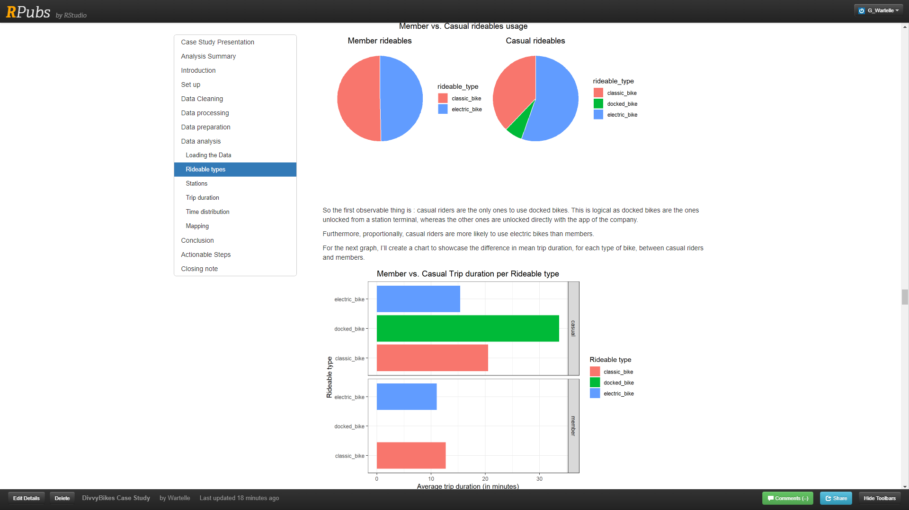
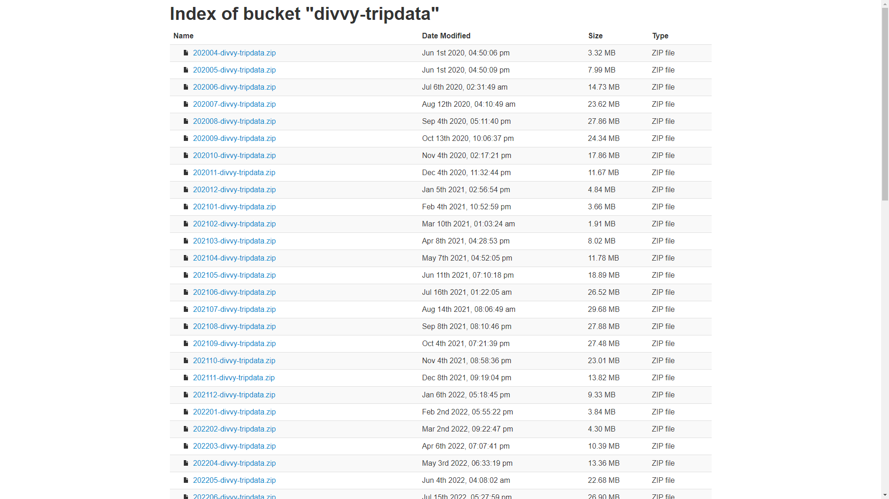
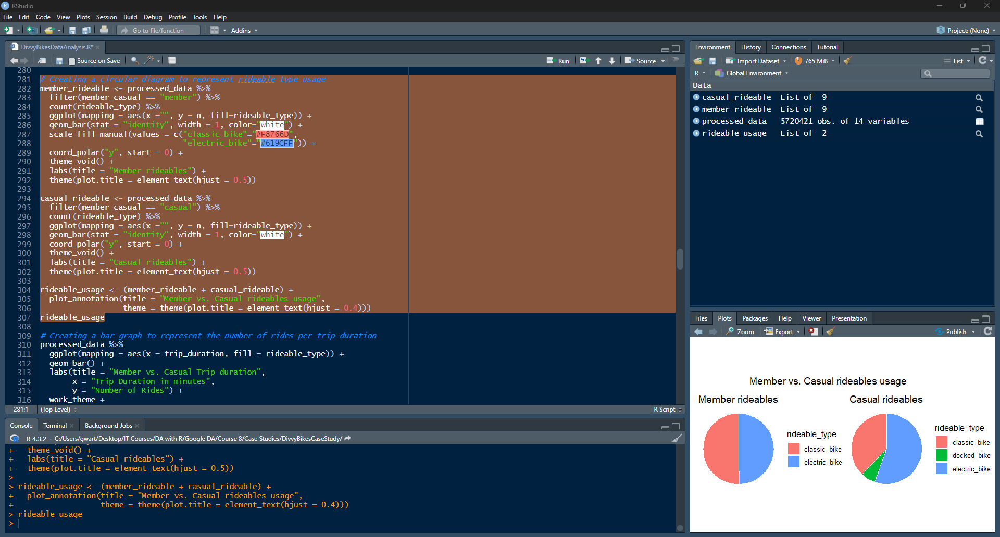
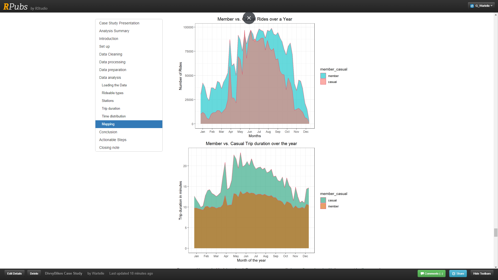
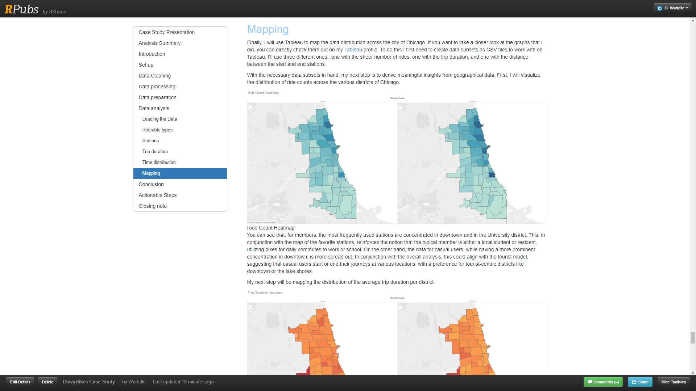

<a id="readme-top"></a>

<!--
*** This README is built upon the Best-README-Template, created by Othneil Drew.
*** If you wish to use this template, go check his repository :
*** https://github.com/othneildrew/Best-README-Template/tree/master
*** And don't forget to give his project a star!
-->

<!-- PROJECT TITLE -->

<div align="center">
  <a href="https://rpubs.com/G_Wartelle/divvy-bikes-case-study">
    
  </a>
</div>
<h1 align="center">Divvy Bikes Case Study</h1>

<!-- TABLE OF CONTENTS -->

<details>
  <summary>Table of Contents</summary>
  <ol>
    <li><a href="#about-the-project">About The Project</a></li>
    <li><a href="#folder-structure">Folder Structure</a></li>
    <li><a href="#cloning-the-project">Cloning the project</a></li>
    <li><a href="#usage">Usage</a></li>
    <li><a href="#challenges">Challenges</a></li>
    <li><a href="#contact">Contact</a></li>
    <li><a href="#acknowledgments">Acknowledgments</a></li>
  </ol>
</details>

<!-- ABOUT THE PROJECT -->

<h2 id="about-the-project">About The Project</h2>



If you want to take a direct look at this data analysis, you can do so by checking right [here](https://rpubs.com/G_Wartelle/divvy-bikes-case-study).

It is hosted on [RPubs](https://rpubs.com/), a service provided by RStudio, where users can publish their R Markdown documents online.

This is a case study focusing on the DivvyBikes rental service.
I conducted this analysis to apply the skills I acquired through the [Google Data Analytics Certificate](https://www.coursera.org/professional-certificates/google-data-analytics) program hosted on [Coursera](https://www.coursera.org/).
The main objective of this study was to identify differences between members and casual users and propose strategies to boost subscription rates for Divvy services.

The analysis was done using [R](https://www.r-project.org/), a statistical computing programming language.
The main library used to make this analysis is [Tidyverse](https://www.tidyverse.org/), as this library has all the necessary tools for data science.
The other libraries used for this project are [skimr](https://cran.r-project.org/web/packages/skimr/vignettes/skimr.html) for summarizing data, [RANN](https://cran.r-project.org/web/packages/RANN/index.html) used for fiding the closest station to a user, [patchwork](https://cran.r-project.org/web/packages/patchwork/index.html) for organizing some plots, [RColorBrewer](https://colorbrewer2.org/#type=sequential&scheme=BuGn&n=3) for different color palettes for plots, and [tibble](https://cran.r-project.org/web/packages/tibble/index.html) for data frames.

Aside from a programming language, I used two other tools for this study.
The first one I used is [Google My Maps](https://www.google.com/maps/d/?hl=en) to create a map of the users' favorite stations.
And the second one, is [Tableau](https://www.tableau.com/), for creating the heatmaps at the end of the analysis.

<p align="right">(<a href="#readme-top">back to top</a>)</p>

<!-- FOLDER STRUCTURE -->

<h2 id="folder-structure">Folder Structure</h2>

In the root of the project, the main file is `CompteRendu.Rmd` as this is the final result of the analysis and is the file hosted on RPubs.
There's also `CompteRendu.html` which is the same file but as a HTML file.
After this, you have this `README.md` file, a `.gitignore` file, a `.Rhistory` file, and `DivvyBikesCaseStudy.Rproj` for configuration.

The rest is organised in folders :

- `Assets/` has the images used for this `README.md` file
- `Data/` has the data used for this study in two folders. First in `Chicago Shapefile/` there is the data used for the heatmaps, and `Study Data/` is where the .csv files used for the study are supposed to go
- `Document/` has the presentation of the case study
- `Output/` has the data created during this analysis, also in two different folders. In `Data/` there are the .rds file with the cleaned data, and the .csv files used to create the heatmaps using [Tableau](https://www.tableau.com/). And in `Maps/` there are the maps created for this study
- The `rsconnect/` folder was created for uploading this analysis on [RPubs](https://rpubs.com/)
- And the `Script/` has the main [R](https://www.r-project.org/) script used to perform the analysis

That's it for the folder structure !

<p align="right">(<a href="#readme-top">back to top</a>)</p>

<!-- CLONING THE PROJECT -->

<h2 id="cloning-the-project">Cloning the project</h2>

If you want to clone this project you just need [Git](https://git-scm.com/downloads).

1. To clone this project, first go in the directory you want to install the project in :

   ```sh
   cd path/to/your/directory
   ```

2. And then run this command to clone the project :

   ```sh
   git clone https://github.com/GWartelle/DivvyBikesCaseStudy.git
   ```

<!-- USAGE EXAMPLES -->

<h2 id="usage">Usage</h2>

Once the project is cloned, if you want to replicate this analysis, the first thing you have to do is to download the .csv files used for this study.
You can do so right [here](https://divvy-tripdata.s3.amazonaws.com/index.html).

This study was done using the data of a full year, so invite you to download the twelve latest .csv files, as they are organised by month.



Once you downloaded the necessary files, you must put them in the `Data/Study Data/` folder, otherwise the script won't work correctly.

And when this is done, the next thing to do is to open the `DivvyBikesDataAnalysis.R` script in your editor.

Normally this should work on any modern IDE, but I would recommend using either [RStudio](https://posit.co/) (now called posit), or [Jupyter](https://jupyter.org/), as these will allow you to easily run the script one chunk of code at a time.

In the script there is also somethinh you'll have to set up :

```r
# Setting the working directory
setwd("")
getwd()
```

In this part of the code, between the "" of `setwd("")`, you'll have to precise the exact directory in which you cloned the project, otherwise the code won't work.

Once this is done you can start running the code of this script. I recommend doing it one chunk of code at a time to better understand the process of the analysis.
Also, as this analysis is dealing with a massive amount of data, running the whole script in one go will be quite slow.



By following the script, you'll eventually go through all the analysis performed on this study's data.

If you wish to present this analysis, you can incorporate it into a Notebook such as a [R Markdown Document](https://rmarkdown.rstudio.com/), or a [Jupyter Notebook](https://jupyter.org/).



And if you're feeling extra-courageous you could even use the three .csv files created at the end of the script, and stored in the `Output/Data/` folder, to create heatmaps using [Tableau](https://www.tableau.com/) (or any other BI tool of your choice).

Otherwise, feel free to use the heatmaps I created in the `Output/Maps/` folder.



Lastly, if you end up with different graphs and results than me, it is absolutely normal as you will probably not use the same data as me, depending on the .csv files you choose to download from the [divvy-tripdata](https://divvy-tripdata.s3.amazonaws.com/index.html).

<p align="right">(<a href="#readme-top">back to top</a>)</p>

<!-- CHALLENGES -->

<h2 id="challenges">Challenges</h2>

Of course, performing this analysis presented its share of challenges.
I won't go over all of them, as they are presented in the `CompteRendu.md` file for the most part, but I would like to show you the most interesting part I had to deal with in this analysis.

The issue I had was that a quarter of the data I used was missing the name of the station of bike trips.
As I would have lost a lot of useful data, I decided to fix this.

After a bit of investigation I found that this was caused by trips ended and/or started outside of a station, as users can use the integrated bike lock to secure their bike.
By doing so, users trigger a start and/or end of trip event without regestering any station name.

To fix this I decided to change these missing values with the name of the closest station, and to do so I collected all the station names and their coordinates in my database :

```r
true_stations <- cbind(station_id, station_name, station_lat, station_lng, station_location) %>%
  count(station_id, station_name, station_lat, station_lng, station_location) %>%
  na.omit() %>%
  group_by(station_id) %>%
  slice_max(order_by = n, n = 1, with_ties = FALSE) %>%
  group_by(station_name) %>%
  slice_max(order_by = n, n = 1, with_ties = FALSE) %>%
  select(-n)
```

Here I assigned the id, name, latitude, longitude and combined coordinates to a new `true_stations` variable, and then grouped the whole set by station name, only keeping the most frequent coordinates for each station (there were slight variations).

Next, I created subsets of data with only the rows with missing data :

```r
start_missing <- clean_data %>%
  select(ride_id, start_station_name, start_lng, start_lat) %>%
  rename(start_missing_name = start_station_name) %>%
  filter(is.na(start_missing_name))

end_missing <- clean_data %>%
  select(ride_id, end_station_name, end_lng, end_lat) %>%
  rename(end_missing_name = end_station_name) %>%
  filter(is.na(end_missing_name))
```

Once this was done, I could tackle the most interesting part : finding the closest stations :

```r
start_coords <- as.matrix(start_missing[, c("start_lng", "start_lat")])
end_coords <- as.matrix(end_missing[, c("end_lng", "end_lat")])
true_coords <- as.matrix(true_stations[, c("station_lng", "station_lat")])

start_neighbors <- RANN::nn2(true_coords, start_coords, k = 1)$nn.idx
start_nearest_stations <- true_stations$station_name[start_neighbors]
start_missing$start_missing_name <- start_nearest_stations

end_neighbors <- RANN::nn2(true_coords, end_coords, k = 1)$nn.idx
end_nearest_stations <- true_stations$station_name[end_neighbors]
end_missing$end_missing_name <- end_nearest_stations
```

Here, after collecting the coordinates of the missing the stations, and the ones from all the stations combined, the only thing left to do was to compare them.

In `start_neighbors <- RANN::nn2(true_coords, start_coords, k = 1)$nn.idx`, the `RANN::nn2` function compares the two matrices, and find the index of the nearest point in space (aka coordinates) in `true_coords` for each point in `start_coords`, and stores them all in `start_neighbors`.

Using the indeces stored in `start_neighbors`, the next line of code assigns the corresping station names in `true_stations` to a new variable, `start_nearest_stations`.
After this, the following line updates the names of the missing stations with those stored in `start_nearest_stations`.

Then I just had to repeat this process with the missing end stations.

Finally, the last thing to do was update the main dataset with these newly gained station names :

```r
filling_stations <- full_join(start_missing, end_missing, by = "ride_id") %>%
  select(ride_id, start_missing_name, end_missing_name)

clean_data <- clean_data %>%
  left_join(filling_stations, by = "ride_id")

clean_data$start_station_name <- ifelse(is.na(clean_data$start_station_name),
                                        clean_data$start_missing_name,
                                        clean_data$start_station_name)

clean_data$end_station_name <- ifelse(is.na(clean_data$end_station_name),
                                      clean_data$end_missing_name,
                                      clean_data$end_station_name)

clean_data <- clean_data %>%
  select(-start_missing_name, -end_missing_name)
```

Here, after combining the updated `start_missing` and `end_missing` datasets into a new `filling_stations` dataset, I joined it to the main dataset based on the `ride_id`.

Then, I simply changed the start station names with the ones from the `filling_stations` if the original one was `NA`, and kept the original if not.

After repeating this for the end station names, the only thing left to do was to get rid of the joined columns from `filling_stations`, to clean up the original dataset.

And with this, I basically saved a quarter of my dataset !

<p align="right">(<a href="#readme-top">back to top</a>)</p>

<!-- CONTACT -->

<h2 id="contact">Contact</h2>

If you want to see more of my work, I invite you to go check my [portfolio](https://gwartelle.github.io/MyPortfolio/).

You can also take a look at my other projects on my [github](https://github.com/GWartelle).

And if you'd like to get in touch with me, feel free to reach out on [LinkedIn](https://www.linkedin.com/in/gabriel-wartelle/).

<p align="right">(<a href="#readme-top">back to top</a>)</p>

<!-- ACKNOWLEDGMENTS -->

<h2 id="acknowledgments">Acknowledgments</h2>

As mentionned above, this data analysis was done as part of Google's [Data Analytics Certificate Cursus](https://www.coursera.org/professional-certificates/google-data-analytics).

So I would like to thank [Google](https://www.coursera.org/instructor/google-career-certificates) for creating such an impressive course, and also [Coursera](https://www.coursera.org/) for providing such an amazing content to the world.

And of course I would like to thank you for taking the time to read through all this !
I wish you the best 😁

Have a great day 😉

<p align="right">(<a href="#readme-top">back to top</a>)</p>
